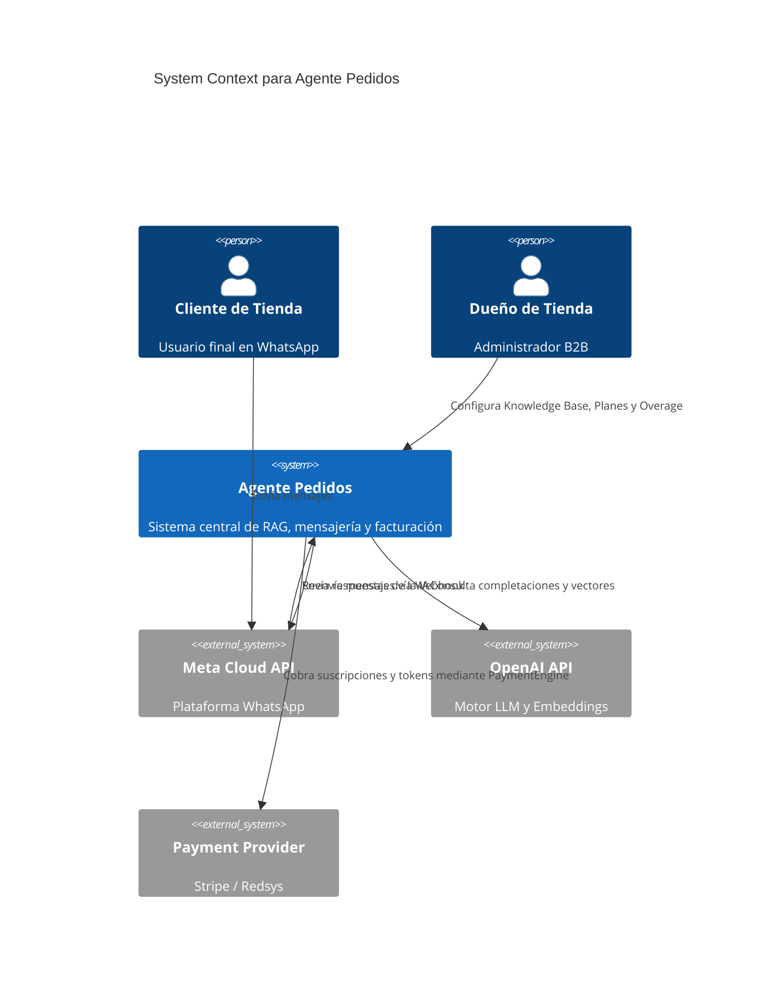
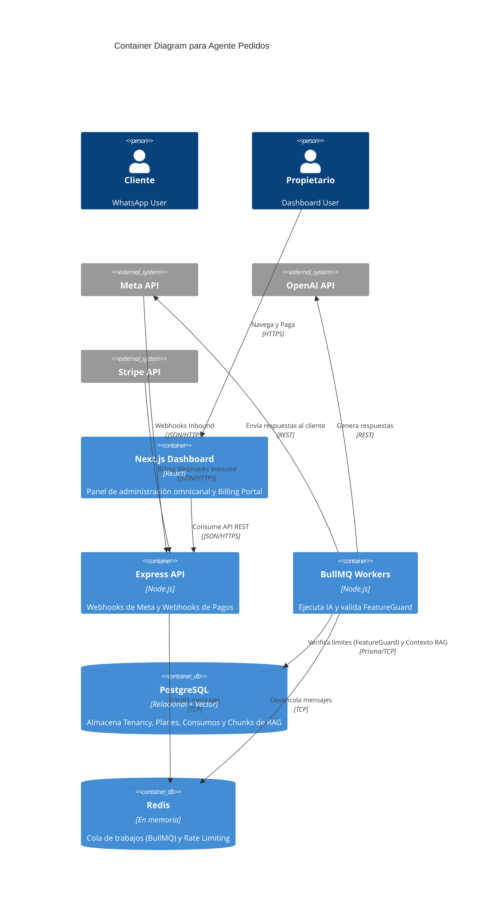

# Modelo C4 (Context & Container)

## 1. System Context Diagram
Muestra el sistema en su entorno macro.

```mermaid
C4Context
  title System Context para Agente Pedidos
  Person(customer, "Cliente de Tienda", "Usuario final en WhatsApp")
  Person(admin, "Dueño de Tienda", "Administrador B2B")
  
  System(system, "Agente Pedidos", "Sistema central de RAG, mensajería y facturación")
  
  System_Ext(meta, "Meta Cloud API", "Plataforma WhatsApp")
  System_Ext(openai, "OpenAI API", "Motor LLM y Embeddings")
  System_Ext(payment_provider, "Payment Provider", "Stripe / Redsys")

  Rel(customer, meta, "Envía mensajes")
  Rel(meta, system, "Reenvía mensajes vía Webhook")
  Rel(system, meta, "Envía respuestas de la IA")
  
  Rel(admin, system, "Configura Knowledge Base, Planes y Overage")
  Rel(system, openai, "Consulta completaciones y vectores")
  Rel(system, payment_provider, "Cobra suscripciones y tokens mediante PaymentEngine")
```

## 2. Container Diagram
Muestra las piezas ejecutables (Contenedores) del sistema.

```mermaid
C4Container
  title Container Diagram para Agente Pedidos
  Person(customer, "Cliente", "WhatsApp User")
  Person(admin, "Propietario", "Dashboard User")
  
  System_Ext(meta, "Meta API")
  System_Ext(openai, "OpenAI API")
  System_Ext(stripe, "Stripe API")
  
  Container(frontend, "Next.js Dashboard", "React", "Panel de administración omnicanal y Billing Portal")
  Container(backend, "Express API", "Node.js", "Webhooks de Meta y Webhooks de Pagos")
  Container(worker, "BullMQ Workers", "Node.js", "Ejecuta IA y valida FeatureGuard")
  
  ContainerDb(db, "PostgreSQL", "Relacional + Vector", "Almacena Tenancy, Planes, Consumos y Chunks de RAG")
  ContainerDb(redis, "Redis", "En memoria", "Cola de trabajos (BullMQ) y Rate Limiting")

  Rel(admin, frontend, "Navega y Paga", "HTTPS")
  Rel(frontend, backend, "Consume API REST", "JSON/HTTPS")
  
  Rel(meta, backend, "Webhooks Inbound", "JSON/HTTPS")
  Rel(stripe, backend, "Billing Webhooks Inbound", "JSON/HTTPS")
  Rel(backend, redis, "Encola mensajes", "TCP")
  
  Rel(worker, redis, "Desencola mensajes", "TCP")
  Rel(worker, db, "Verifica límites (FeatureGuard) y Contexto RAG", "Prisma/TCP")
  Rel(worker, openai, "Genera respuestas", "REST")
  Rel(worker, meta, "Envía respuestas al cliente", "REST")
```
