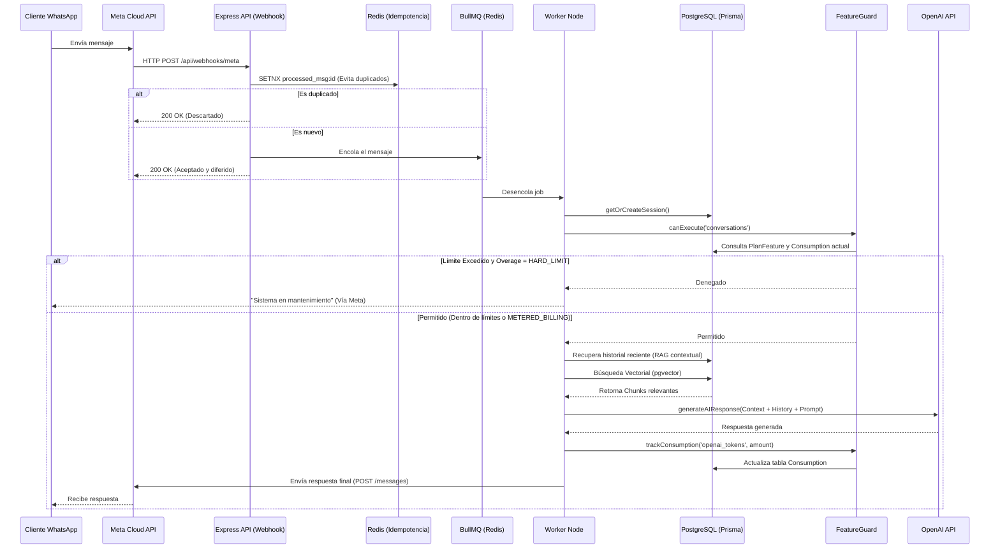
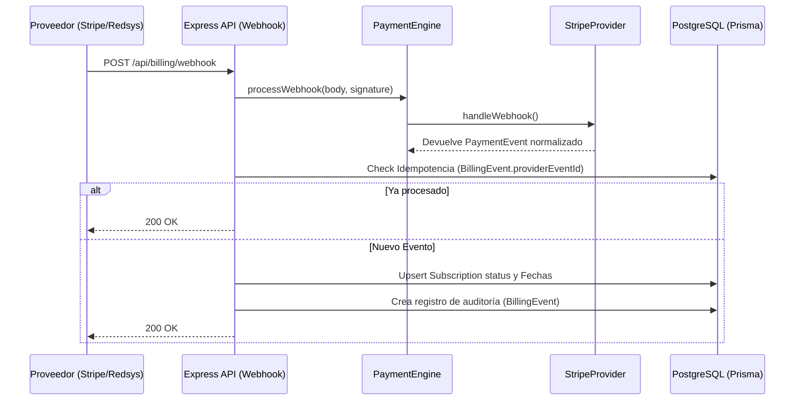

# Flujo de Datos y Eventos

## 1. Recepción y Procesamiento de Mensajes (Inbound)

El flujo crítico del sistema es la recepción de un mensaje de WhatsApp y su respuesta. Este proceso está optimizado para la máxima fiabilidad y baja latencia.

## 2. Flujo de Billing (Webhooks de Pago)

Este diagrama ilustra cómo el PaymentEngine maneja los cobros y actualizaciones de suscripción de forma agnóstica.

