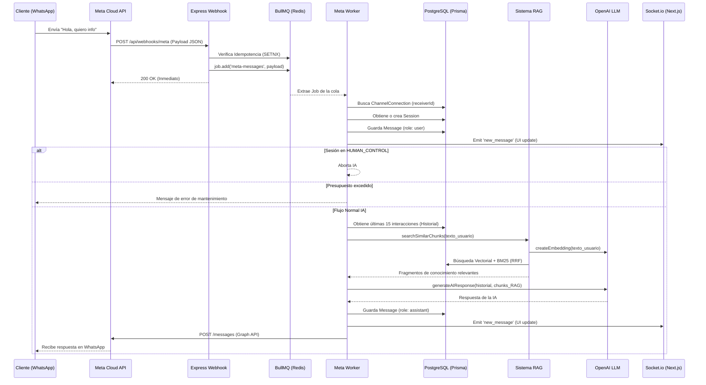

# Flujo de Datos (Data Flow)

Este documento traza el ciclo de vida completo de un mensaje desde que un cliente escribe por WhatsApp hasta que recibe la respuesta de la IA.

## Ciclo de Vida de un Mensaje (WhatsApp a IA)

### Explicaciones de los pasos clave

1. **Idempotencia (`SETNX`)**: Meta reintenta los webhooks si hay fallos de red. Para evitar respuestas duplicadas, usamos `Redis SETNX` con el ID único del mensaje que provee Meta. Si ya existe, se descarta silenciosamente.
2. **ChannelConnection Resolution**: El worker busca a qué comercio pertenece el número de WhatsApp receptor. Si un mensaje llega pero no hay conexión en la base de datos (por error de tipeo en el ID, por ejemplo), el worker lo descarta con error.
3. **Control de Contexto (Windowing)**: Solo enviamos a OpenAI los últimos 15 mensajes de la sesión para ahorrar tokens y evitar el desbordamiento de la ventana de contexto.
4. **Handoff (Control Humano)**: El chequeo de estado de la sesión (`HUMAN_CONTROL`) se hace en el worker *antes* de llamar al RAG o a OpenAI, garantizando que el bot no se entrometa si un humano está al mando.
