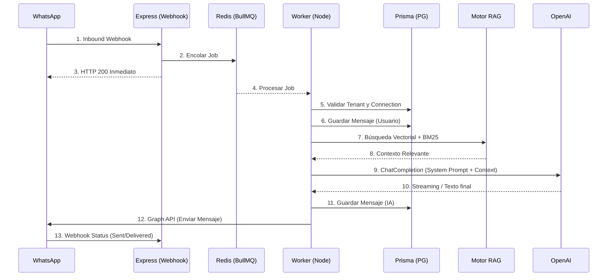

# Ciclo de Vida de una Conversación (Completo)

```mermaid
sequenceDiagram
    participant WA as WhatsApp
    participant API as Express (Webhook)
    participant Q as Redis (BullMQ)
    participant W as Worker (Node)
    participant DB as Prisma (PG)
    participant RAG as Motor RAG
    participant LLM as OpenAI
    
    WA->>API: 1. Inbound Webhook
    API->>Q: 2. Encolar Job
    API-->>WA: 3. HTTP 200 Inmediato
    
    Q-->>W: 4. Procesar Job
    W->>DB: 5. Validar Tenant y Connection
    W->>DB: 6. Guardar Mensaje (Usuario)
    
    W->>RAG: 7. Búsqueda Vectorial + BM25
    RAG-->>W: 8. Contexto Relevante
    
    W->>LLM: 9. ChatCompletion (System Prompt + Context)
    LLM-->>W: 10. Streaming / Texto final
    
    W->>DB: 11. Guardar Mensaje (IA)
    W->>WA: 12. Graph API (Enviar Mensaje)
    
    WA->>API: 13. Webhook Status (Sent/Delivered)
```
