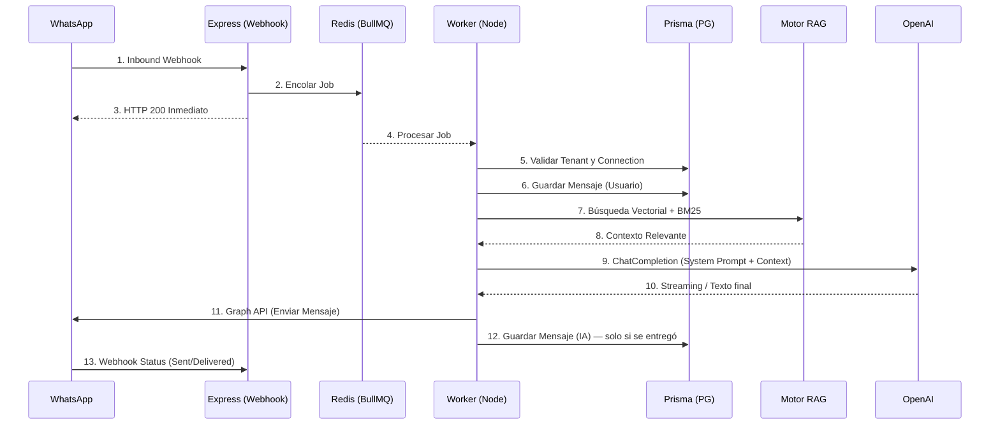

# Ciclo de Vida de una Conversación (Completo)

## Semántica de reintentos y persistencia (recuperación 2026-09)

El flujo real difiere del diagrama original en tres puntos críticos, corregidos con tests
(`src/test/worker-processor.test.ts`):

1. **Idempotencia por intento**: la clave Redis `processed_msg:<id>` solo se comprueba en el
   **primer intento** del job (`attemptsMade === 0`). Si se comprobase también en los reintentos,
   un fallo transitorio (ej. OpenAI caída) descartaría el mensaje en el reintento y el job
   terminaría "completado" sin que el cliente recibiera respuesta. La protección contra
   duplicados reales vive en el webhook (`src/webhooks/middleware/idempotency.ts`).
2. **Enviar antes de persistir**: el mensaje del assistant solo se guarda en la BD **después** de
   que el envío por el canal tenga éxito (`sendOmnichannelFormattedMessage`). Por tanto, cada
   `Message` con `role='assistant'` en la BD corresponde a un mensaje realmente entregado.
   Si el envío falla, el error se propaga y BullMQ reintenta (3 intentos, backoff exponencial);
   en el fallo definitivo la sesión pasa a `HUMAN_REQUESTED` con una nota de sistema.
3. **Errores de envío no se tragan**: `sendWhatsAppMessage` / `sendWhatsAppFormattedMessage`
   (`src/integrations/whatsapp.ts`) relanzan los errores de la Graph API (se conserva el fallback
   de botones→texto; si el fallback también falla, el error se propaga).

Además, los workers y la API implementan **graceful shutdown** (`SIGTERM`/`SIGINT`: terminar el
job en curso y cerrar conexiones) y las colas usan `removeOnComplete`/`removeOnFail` para no
acumular jobs indefinidamente en Redis.
