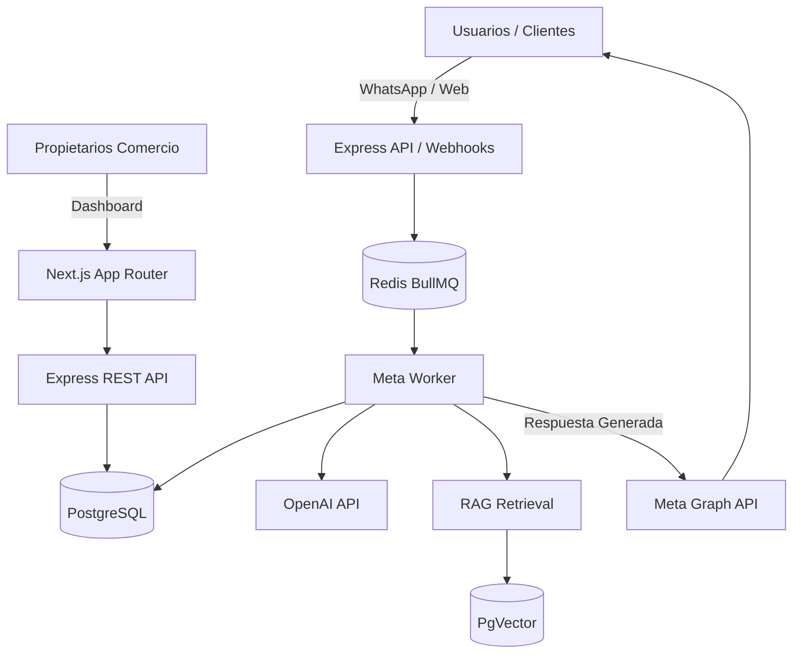

# Resumen de Arquitectura (Overview)

Este documento describe la arquitectura general del Agente Pedidos ("Mi Negocio IA"). El sistema está diseñado para ser altamente concurrente, resistente a fallos de red (especialmente webhooks de terceros) y seguro (aislamiento de datos multi-tenant).

## 1. Topología del Sistema

El proyecto sigue un patrón **BFF (Backend for Frontend)** desacoplado con una capa de procesamiento asíncrono en background.

## 2. Principios Arquitectónicos

1. **Procesamiento Asíncrono (Event-Driven)**: Los webhooks de Meta imponen límites de tiempo (timeout) muy estrictos. Si tardamos más de 3 segundos en procesar un mensaje (por ejemplo, porque la IA de OpenAI tarda en generar la respuesta), Meta corta la conexión y reintenta. Por esto, los webhooks *solo* insertan en una cola de Redis (BullMQ) y responden inmediatamente con `200 OK`.
2. **Multi-Tenancy por Diseño**: El modelo `Commerce` actúa como separador absoluto. Todas las consultas a la base de datos de sesiones, mensajes, conocimiento y configuración deben filtrar por `commerceId`.
3. **Cero Alucinaciones (RAG Estricto)**: El agente de IA tiene prohibido usar su conocimiento general. Solo puede responder basándose en el contexto inyectado desde la base vectorial (`pgvector`).
4. **Handoff (Control Humano)**: En cualquier momento, un agente humano puede pausar a la IA desde el dashboard. El worker verifica el `status` de la sesión antes de llamar a OpenAI, abortando el flujo de IA si está en `HUMAN_CONTROL`.

## 3. Desacoplamiento Frontend/Backend

- **Backend**: Express.js corriendo en el puerto 3001. Contiene la lógica dura: webhooks, workers, Prisma Client, generación de LLM, y la API REST para el dashboard.
- **Frontend**: Next.js corriendo en el puerto 3000. Consume la API REST del backend para gestionar sesiones, documentos, y configuraciones. Usa Socket.io para recibir notificaciones en tiempo real cuando el Worker de IA responde a un cliente, manteniendo el dashboard actualizado sin refrescar.
