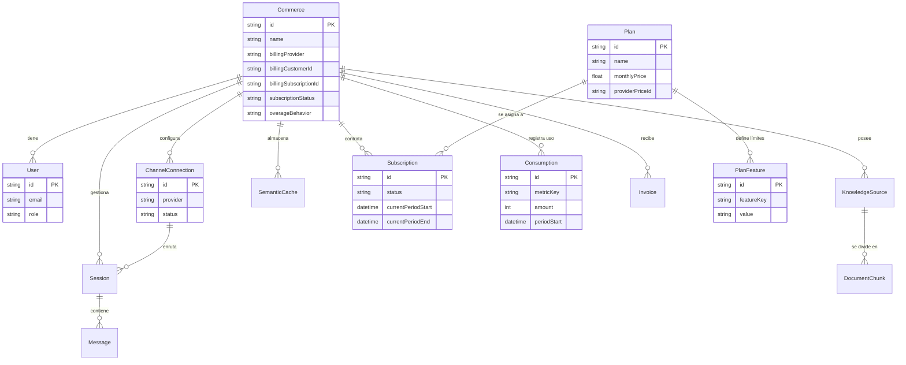

# Modelo de Datos (Prisma)

El sistema utiliza PostgreSQL como motor de base de datos principal, interactuando con él a través de **Prisma ORM**. Se hace uso intensivo de la extensión `pgvector` para las funcionalidades de Inteligencia Artificial (Búsqueda Vectorial y Caché Semántica).

## 1. Diagrama de Entidad-Relación (ER)

## 2. Descripción del Dominio de Facturación (Billing)

El sistema de facturación ha sido diseñado para ser completamente multi-provider y guiado por datos (Data-Driven), eliminando el código estático ("if plan == X").

- **Plan**: Representa un producto comercial (ej. "Pro Mensual"). Define el precio (para ser creado en Stripe/Redsys) y un identificador.
- **PlanFeature**: Es la piedra angular del sistema. Son pares Clave-Valor que dictan las capacidades de un plan (ej. `max_conversations = 1000`, `whatsapp_enabled = true`). Esto permite crear nuevos planes desde el Dashboard de administración sin necesidad de añadir columnas nuevas a la base de datos ni desplegar código.
- **Subscription**: Vincula un comercio con un Plan durante un periodo de tiempo.
- **Consumption**: Rastrea el uso de métricas específicas (ej. tokens de OpenAI, conversaciones) durante el periodo de facturación actual. El `FeatureGuard` lee esta tabla en cada mensaje para validar los límites en tiempo real.
- **BillingEvent**: (Omitido del diagrama por simplicidad). Funciona como un Log Inmutable de cada Webhook recibido del proveedor de pago, utilizando el `providerEventId` para bloquear el doble procesamiento de webhooks repetidos por fallos de red.

## 3. Descripción de Entidades del Negocio Core

### Commerce (Tenant Central)
El nodo central del sistema B2B. Todas las queries de la aplicación web y de los workers deben filtrar obligatoriamente por `commerceId` para garantizar la segregación de datos. 
**Gestión de Overage:** Incluye el campo `overageBehavior` que permite al cliente decidir si desea apagar su bot al superar el límite (`HARD_LIMIT`) o permitir que siga funcionando y pagar la diferencia (`METERED_BILLING`).

### ChannelConnection
Almacena las credenciales y el estado de la conexión con plataformas de mensajería (ej. WhatsApp, Telegram). Las contraseñas y tokens sensibles (`accessToken`) se almacenan cifrados simétricamente (AES-256).

### KnowledgeSource & DocumentChunk
Soporte para el RAG. `KnowledgeSource` es el documento original (un PDF, un texto, una web), y `DocumentChunk` son los fragmentos vectorizados tras pasar por el TextSplitter de LangChain.

### Session & Message
Modelan la conversación. Una `Session` agrupa los mensajes entre un Comercio y un Cliente final (Customer) a través de un canal concreto. Solo los mensajes recientes (ventana de contexto) se envían al LLM para ahorrar tokens.
