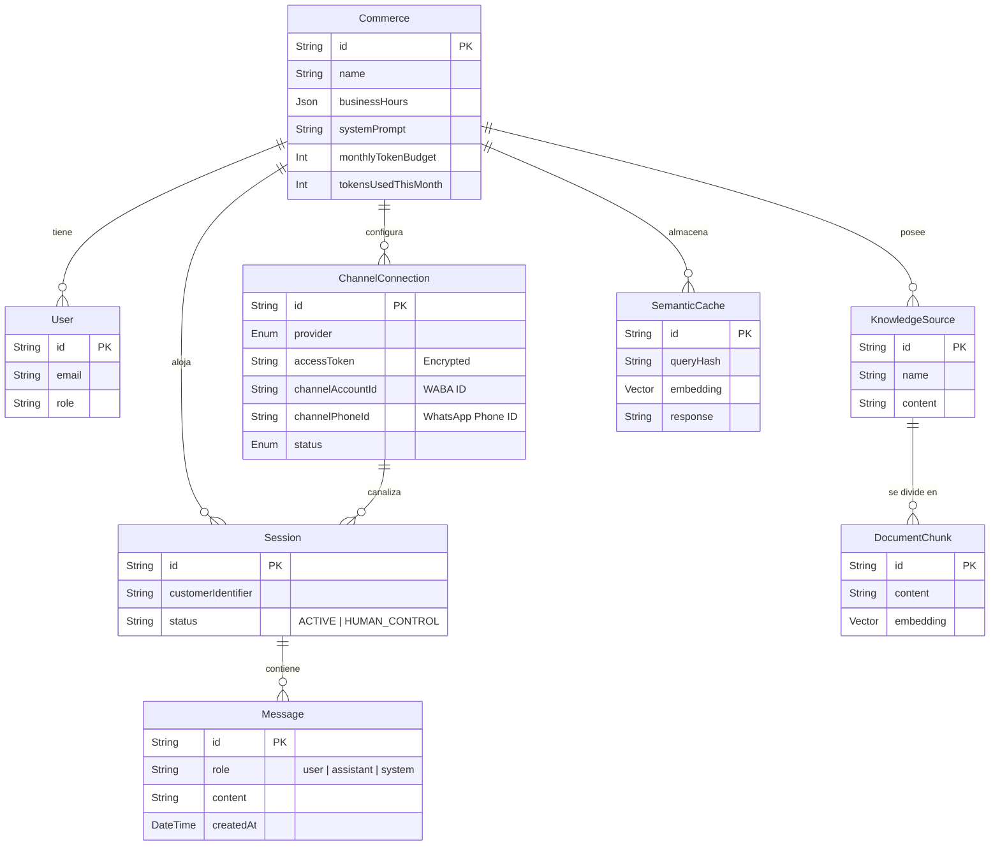

# Modelo de Datos (Prisma)

El sistema utiliza PostgreSQL como motor de base de datos principal, interactuando con él a través de **Prisma ORM**. Se hace uso intensivo de la extensión `pgvector` para las funcionalidades de Inteligencia Artificial (Búsqueda Vectorial y Caché Semántica).

## Diagrama Entidad-Relación (ER)

## Entidades Principales

### `Commerce` (Multi-Tenancy)
Es la entidad raíz. Define un negocio (tenant). Todas las entidades operacionales cuelgan directa o indirectamente de un `Commerce`. Si se elimina un `Commerce` (`onDelete: Cascade`), se elimina absolutamente todo su ecosistema (sesiones, conocimiento, conexiones, usuarios).
- **Control de Gasto**: Contiene los campos `monthlyTokenBudget` y `tokensUsedThisMonth` para limitar el uso de OpenAI.

### `ChannelConnection`
Representa la integración de un comercio con un canal de comunicación (ej. META para WhatsApp).
- Almacena credenciales de forma cifrada (AES-256) en `accessToken`.
- Para Meta, `channelAccountId` es el ID de la cuenta de WABA (WhatsApp Business Account) o de la Página, y `channelPhoneId` es el ID numérico del teléfono (este campo es clave para cruzar el webhook con el comercio correcto).

### `Session` y `Message`
- `Session` representa una conversación continua con un cliente único (`customerIdentifier`). Las sesiones tienen un `status` que determina si la IA responde (`ACTIVE`) o si un humano ha tomado el control (`HUMAN_CONTROL`).
- `Message` es el historial de chat inmutable. Almacena si lo escribió el usuario (`role: "user"`), la IA o el humano (`role: "assistant"`), o el sistema (`role: "system"`).

### `KnowledgeSource` y `DocumentChunk` (RAG)
- `KnowledgeSource` es el documento original subido por el dueño (un texto, un PDF).
- `DocumentChunk` representa los fragmentos (trozos) en los que se dividió el documento. Contiene un vector numérico de 1536 dimensiones (`embedding`) generado por OpenAI (`text-embedding-3-small`), necesario para la búsqueda de similitud.

### `SemanticCache`
Actúa como un firewall de costes para OpenAI. Cuando un usuario hace una pregunta, calculamos el hash y el embedding de la misma. Si encontramos una pregunta semánticamente idéntica (distancia de coseno mínima) en la caché, devolvemos la respuesta precalculada en lugar de llamar a OpenAI, ahorrando tiempo y dinero.
