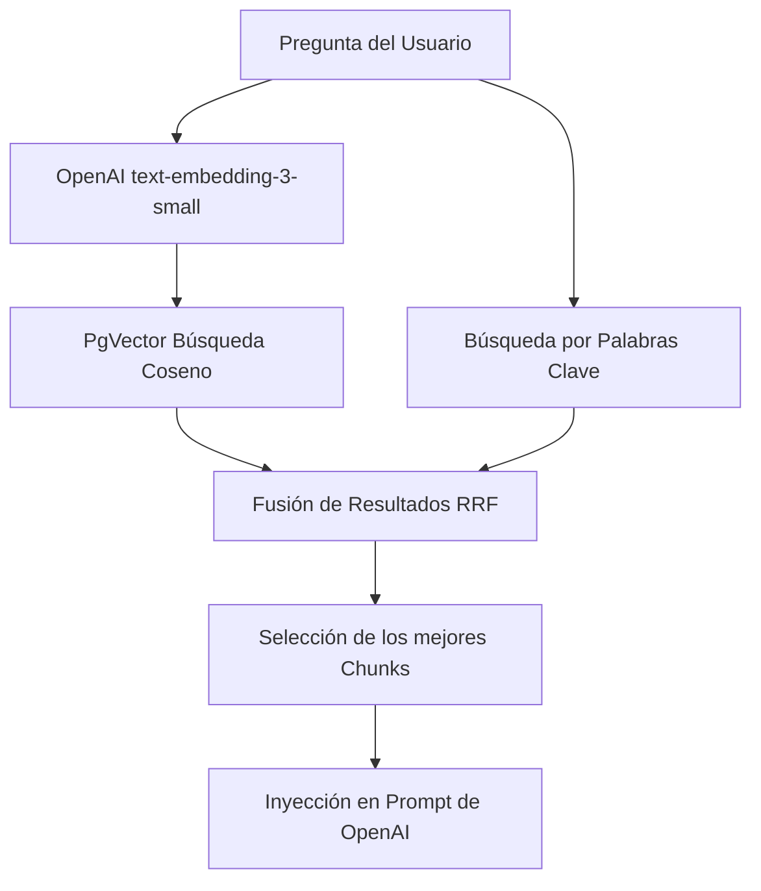

# Sistema RAG (Retrieval-Augmented Generation)

Este documento describe la estrategia RAG implementada en el Agente Pedidos para garantizar respuestas precisas, contextuales y libres de alucinaciones.

## Arquitectura del RAG

El sistema utiliza un enfoque **RAG Híbrido** (Búsqueda Vectorial + Búsqueda Léxica/Keyword) fusionado con **Reciprocal Rank Fusion (RRF)**.

## 1. Ingesta de Documentos (El Cerebro)
Cuando un comercio añade conocimiento (texto plano o procesado desde PDF):
1. El texto entra en un `RecursiveCharacterTextSplitter` de LangChain.
2. Se divide en "chunks" (fragmentos) de ~500 caracteres, con un overlap (solapamiento) de 50 caracteres para no perder el contexto entre párrafos.
3. Cada chunk se envía a la API de OpenAI para obtener su `embedding` (un vector de 1536 dimensiones).
4. El texto original y su vector se guardan en la tabla `DocumentChunk` en PostgreSQL.

## 2. Recuperación Híbrida (Retrieval)
Cuando llega un mensaje de WhatsApp:
1. **Búsqueda Vectorial (Semántica)**: Convierte la pregunta del cliente en un vector y hace una búsqueda matemática en `PgVector` (`embedding <=> query_vector`) limitando a una distancia menor a 0.25 (similitud > 0.75).
2. **Búsqueda Léxica (Por palabras)**: (Opcional según entorno de base de datos) Se buscan coincidencias exactas de texto (`tsvector`) para asegurar que si el usuario busca una referencia exacta (ej: "SKU-1234"), el RAG la encuentre aunque semánticamente sea un texto plano.
3. **Fusión (RRF)**: Se combinan los resultados de ambas búsquedas penalizando/premiando el ranking de cada resultado.

## 3. Inyección y Prompting Cero Alucinaciones
Una vez obtenidos los top 3-4 chunks más relevantes, se inyectan en el `System Prompt` de OpenAI.

> **Fragmento del código crítico (`worker.ts`):**
> "INFORMACIÓN DE LA BASE DE CONOCIMIENTO (SOLO PUEDES USAR ESTA INFORMACIÓN): [Contexto inyectado]
> REGLA ESTRICTA DE SEGURIDAD: Eres un asistente exclusivo... BAJO NINGÚN CONCEPTO debes responder a preguntas de cultura general... no inventes datos."

## 4. Semantic Caching
Antes siquiera de llegar al RAG, calculamos el embedding de la pregunta. Buscamos en la tabla `SemanticCache` respuestas generadas previamente para la misma pregunta (umbral estricto: similitud > 0.95). 
- Si hay *Hit*, retornamos la respuesta en <50ms y costo $0.
- Si hay *Miss*, pasamos al flujo RAG estándar y al finalizar guardamos la respuesta generada en el Caché.
